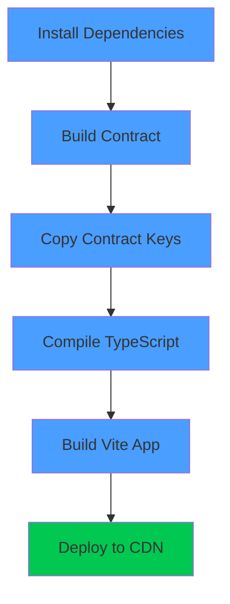

# 🚀 Vercel Deployment Guide

## Prerequisites

Before deploying to Vercel, ensure you have:

1. **Deployed Contract**: Your smart contract must be deployed to Midnight Preview Network
2. **Vercel Account**: Sign up at [vercel.com](https://vercel.com)
3. **GitHub Repository**: Your code should be pushed to GitHub (already done ✅)

---

## 🔧 Pre-Deployment Setup

### 1. Deploy Contract to Preview Network

First, deploy your contract to Midnight's Preview Network (required for production):

```powershell
# Navigate to counter-cli
cd counter-cli

# Update src/config.ts to use PreviewConfig
# Then deploy
npm run deploy
```

After deployment, note the contract address from `counter-cli/deployment.json`.

### 2. Build the Contract

Ensure the contract is built and ready:

```powershell
# From project root
npm run build
```

This compiles the Compact contract and generates the necessary keys and ZK circuit files.

---

## 📦 Deploy to Vercel

### Option 1: Deploy via Vercel Dashboard (Recommended)

1. **Go to Vercel Dashboard**
   - Visit [vercel.com/new](https://vercel.com/new)
   - Click "Import Project"

2. **Import Your GitHub Repository**
   - Select your `midnight-starter-template` repository
   - Click "Import"

3. **Configure Project Settings**
   - **Framework Preset**: Other
   - **Root Directory**: `./` (leave as default)
   - **Build Command**: `cd frontend-vite-react && npm run build`
   - **Output Directory**: `frontend-vite-react/dist`
   - **Install Command**: `npm install`

4. **Set Environment Variables**
   
   Click "Environment Variables" and add:
   
   | Name | Value |
   |------|-------|
   | `VITE_CONTRACT_ADDRESS` | Your contract address from deployment.json |
   
   Optional (for custom network configuration):
   | Name | Value |
   |------|-------|
   | `VITE_INDEXER_URL` | `https://indexer.preview.midnight.network/api/v3/graphql` |
   | `VITE_INDEXER_WS_URL` | `wss://indexer.preview.midnight.network/api/v3/graphql/ws` |
   | `VITE_NODE_URL` | `wss://rpc.preview.midnight.network` |
   | `VITE_NETWORK_ID` | `preview` |

5. **Deploy**
   - Click "Deploy"
   - Wait for build to complete (~2-3 minutes)
   - Your app will be live at `https://your-project.vercel.app`

### Option 2: Deploy via Vercel CLI

```powershell
# Install Vercel CLI globally
npm install -g vercel

# Login to Vercel
vercel login

# Deploy from project root
vercel

# Follow the prompts:
# - Set up and deploy: Yes
# - Scope: Your account
# - Link to existing project: No
# - Project name: midnight-counter-dapp
# - Directory: ./
# - Override settings: Yes
#   - Build Command: cd frontend-vite-react && npm run build
#   - Output Directory: frontend-vite-react/dist
#   - Install Command: npm install

# Add environment variables
vercel env add VITE_CONTRACT_ADDRESS

# Deploy to production
vercel --prod
```

---

## 🌐 Post-Deployment Configuration

### 1. Verify Deployment

Visit your deployment URL and check:
- ✅ Page loads successfully
- ✅ Wallet connection works
- ✅ Counter page is accessible
- ✅ Contract state loads properly

### 2. Test Contract Interaction

1. Connect your Lace wallet
2. Navigate to the Counter page
3. Try incrementing the counter
4. Verify state updates correctly

### 3. Custom Domain (Optional)

To add a custom domain:
1. Go to your project in Vercel Dashboard
2. Settings → Domains
3. Add your domain and follow DNS configuration steps

---

## 🔒 Security Considerations

### Environment Variables

- **Never commit `.env` files** to version control
- Use Vercel's environment variable management
- Contract address is public (safe to expose)
- Never expose private keys or seed phrases

### CORS Headers

The `vercel.json` configuration includes necessary headers for:
- WebAssembly (WASM) execution
- SharedArrayBuffer support
- Zero-knowledge proof generation

```json
{
  "Cross-Origin-Embedder-Policy": "require-corp",
  "Cross-Origin-Opener-Policy": "same-origin"
}
```

---

## 📊 Build Process

Vercel will execute these steps during deployment:



1. **Install Dependencies** (`npm install`)
2. **Build Contract** (TypeScript compilation)
3. **Copy Contract Keys** (ZK circuit files to public folder)
4. **Compile TypeScript** (`tsc -b`)
5. **Build Vite App** (`vite build`)
6. **Deploy to CDN** (Vercel's global edge network)

---

## 🐛 Troubleshooting

### Build Fails: "Cannot find module '@meshsdk/counter-contract'"

**Solution**: Ensure contract is built before frontend build
```json
// This is already configured in package.json
"build": "npm run copy-contract-keys && tsc -b && vite build"
```

### Build Fails: "ENOENT: no such file or directory"

**Solution**: Check that contract keys exist
```powershell
# Locally verify files exist
ls counter-contract/src/managed/counter/keys
ls counter-contract/src/managed/counter/zkir
```

### Runtime Error: "Contract address not configured"

**Solution**: Set `VITE_CONTRACT_ADDRESS` in Vercel environment variables
1. Go to Vercel Dashboard → Your Project → Settings → Environment Variables
2. Add `VITE_CONTRACT_ADDRESS` with your deployed contract address
3. Redeploy the application

### Wallet Connection Fails

**Solution**: Check CORS headers
- Verify `vercel.json` has correct headers
- Check browser console for security errors
- Ensure Lace wallet extension is installed

### Contract State Doesn't Load

**Possible Issues**:
1. **Wrong Network**: Ensure contract is deployed to Preview Network
2. **Wrong Address**: Double-check `VITE_CONTRACT_ADDRESS` environment variable
3. **Indexer Issues**: Check Midnight Network status at [docs.midnight.network](https://docs.midnight.network)

### WebAssembly Errors

**Solution**: Headers are configured in `vercel.json`
- Cross-Origin-Embedder-Policy: require-corp
- Cross-Origin-Opener-Policy: same-origin

If issues persist, check Vercel deployment logs for detailed error messages.

---

## 🔄 Continuous Deployment

Vercel automatically redeploys when you push to your GitHub repository:

```powershell
# Make changes
git add .
git commit -m "Update application"
git push origin main

# Vercel automatically:
# 1. Detects the push
# 2. Runs build
# 3. Deploys to production
```

### Branch Deployments

- **`main` branch**: Deploys to production (`your-project.vercel.app`)
- **Other branches**: Deploy to preview URLs (`your-project-git-branch.vercel.app`)

---

## 📚 Additional Resources

- **[Vercel Documentation](https://vercel.com/docs)**: Official Vercel docs
- **[Vite Deployment Guide](https://vitejs.dev/guide/static-deploy.html)**: Vite-specific deployment info
- **[Midnight Preview Network](https://docs.midnight.network/preview/network/)**: Network information

---

## ✅ Deployment Checklist

Before deploying, confirm:

- [ ] Contract deployed to Preview Network
- [ ] Contract address saved from `deployment.json`
- [ ] Contract built successfully (`npm run build`)
- [ ] Code pushed to GitHub
- [ ] Vercel account created
- [ ] Environment variables ready
- [ ] `vercel.json` configuration in place

After deploying, verify:

- [ ] Build completes successfully
- [ ] Application loads at deployment URL
- [ ] Wallet connection works
- [ ] Contract state displays correctly
- [ ] Increment function works
- [ ] No console errors

---

## 🎉 Success!

Your Midnight Counter DApp is now live on Vercel! Share your deployment URL and showcase your zero-knowledge DApp to the world.

**Example Live Demo**: Your app will be available at `https://your-project.vercel.app`
